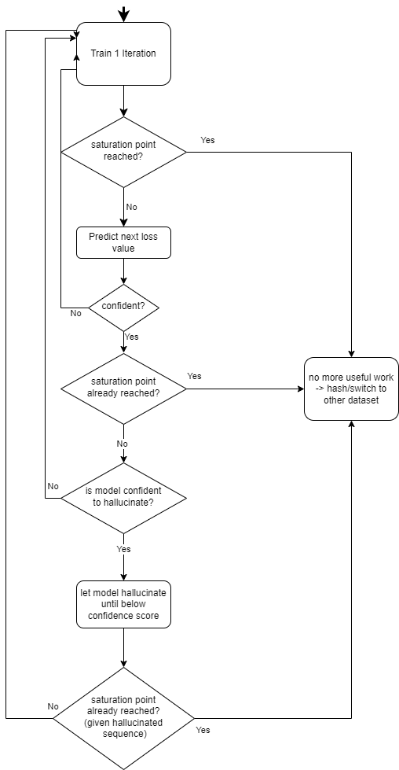

# Proof of Useful Work (D-PoDL) Test Pipeline

## Introduction
Blockchain technologies have revolutionized decentralized networks, but traditional Proof-of-Work (PoW) systems suffer from excessive energy consumption. This project explores an alternative approach—Proof-of-Useful-Work (PoUW)—by integrating deep learning tasks into mining. Specifically, it focuses on Proof-of-Deep-Learning (PoDL), where computational resources are used for training machine learning models instead of solving cryptographic puzzles.

A key challenge in PoDL is determining when model training remains useful. This project introduces a Transformer-based model to predict the evolution of a model’s loss function, identifying saturation points where further training yields diminishing returns. Additionally, a stabilization algorithm detects when training is no longer productive.

Experimental results show that this framework optimizes resource allocation by stopping inefficient training, thereby improving computational efficiency. The proposed enhancements address limitations of static thresholds and contribute to a more adaptive D-PoDL system.

## About This Repository
This repository provides a test pipeline for the Proof-of-Useful-Work (D-PoDL) framework. The test script `test.py` allows users to evaluate the pipeline by running proof-of-work (PoW) and distributed proof-of-deep-learning (D-PoDL) tasks. The modular architecture enables flexibility in swapping predictor models and tasks, making it highly customizable.

## Parameters in `test.py`
The following parameters in `test.py` control the execution of the pipeline:

- `difficulty = 0` – Defines the pre-hash difficulty level for the PoW verification process. Set to 0 for testing purposes but can be adjusted to also influence block time.
- `post_difficulty = 0` – Specifies the post-check difficulty level for D-PoDL verification. Set to 0 for testing purposes but can be adjusted to also influence block time.
- `max_iteration = 100` – The maximum number of training iterations for the deep learning task.
- `max_post_check_iteration = 10` – The maximum number of post-check iterations for verifying the model's integrity.

## Modularity and Extensibility
### Process Flow
Below is an image illustrating the core procedure, where the predictor forecasts loss values and the stabilization detection algorithm determines whether the saturation point of the (validation) loss function has been reached.



### Predictors
In the `dpodl_core` folder, the `predictor.py` file defines the predictor used for forecasting loss values. This predictor can be modified or swapped with different models to test alternative forecasting approaches.

### Tasks
Tasks such as `MNISTtask` and `CIFAR10task` are implemented as modular components. Users can swap or extend tasks as long as they implement the base abstract class `TaskInterface`. This ensures seamless integration of new deep learning tasks into the D-PoDL pipeline.

## Running the Test Pipeline
To test the pipeline, first install the required dependencies by running:
```bash
pip install -r requirements.txt
```
Then, execute the test script with:
```bash
python test.py
```
This will execute the PoW and D-PoDL tasks, logging runtimes and generating performance plots. At the end, two plots will be produced, showing the trained models' accuracy and loss over time. Additionally, during the entire training process, console outputs will provide insights into the progress.

## Contributions
Contributions are welcome! Feel free to add new tasks, improve predictors, or optimize the PoW/D-PoDL framework to enhance efficiency and adaptability.
